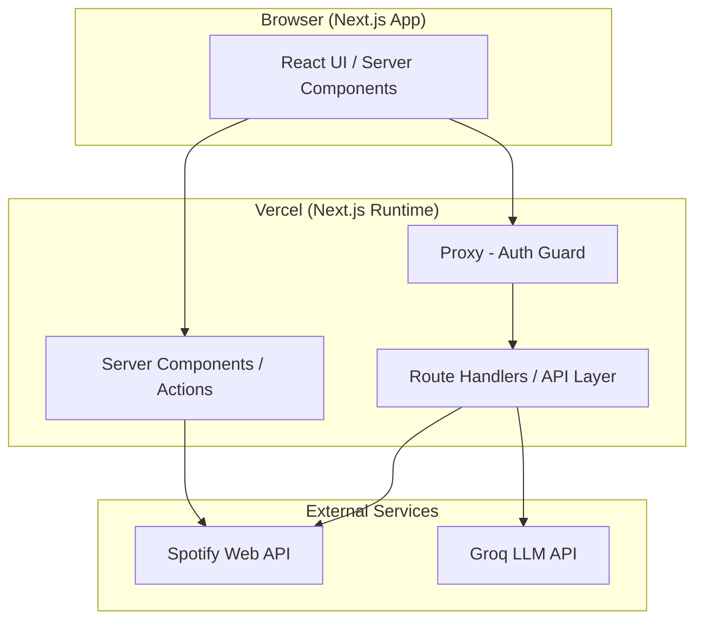
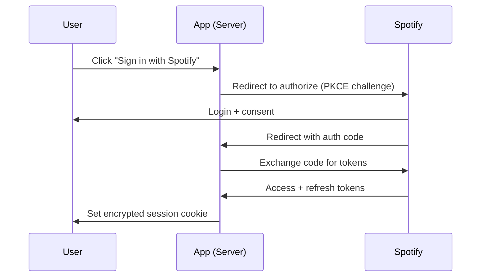
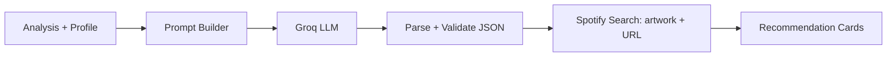
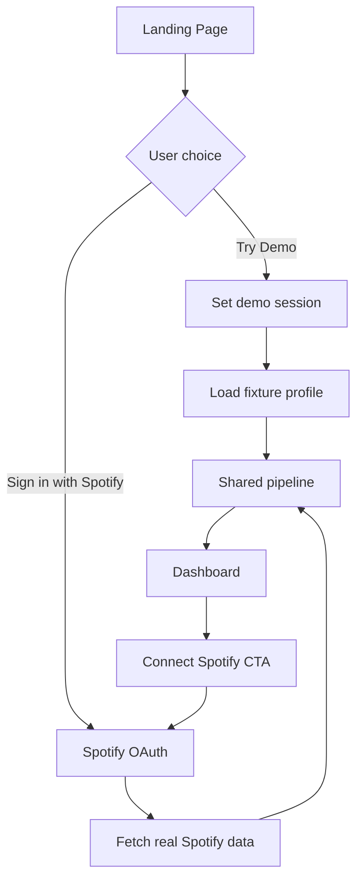
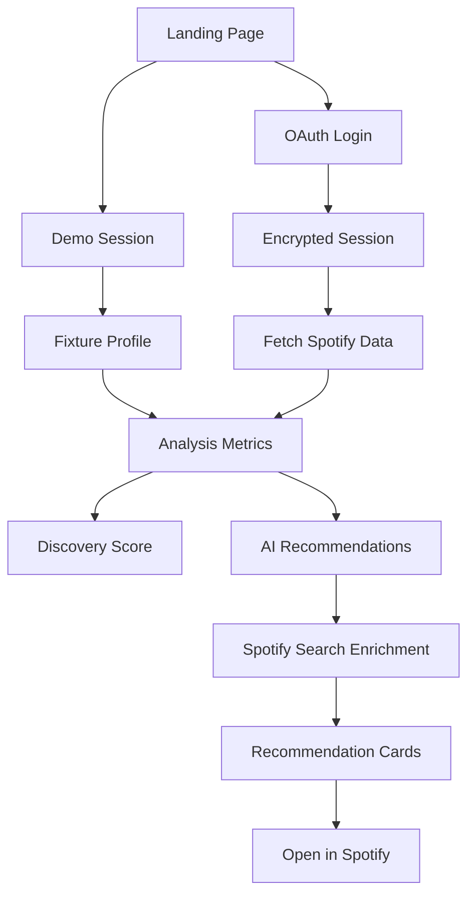

# AI Discovery Coach — Phase-Wise Architecture

This document defines the technical architecture for **AI Discovery Coach**, organized into delivery phases. Each phase is independently shippable, builds on the previous one, and maps directly to the requirements in [`problemStatement.md`](./problemStatement.md).

---

## 1. Architecture at a Glance

### 1.1 System Context



### 1.2 High-Level Layering

| Layer | Responsibility | Key Tech |
|-------|----------------|----------|
| Presentation | UI, animations, states (loading/empty/error) | Next.js App Router, React, Tailwind |
| Application | Orchestration, use-cases, request validation | Route Handlers, Server Actions, Zod |
| Domain | Analysis, scoring, recommendation logic | Pure TS modules (framework-agnostic) |
| Integration | Spotify + Groq clients, mappers, caching | fetch wrappers, typed clients |
| Platform | Auth/session, config, logging, deployment | NextAuth/OAuth, env, Vercel |

### 1.3 Design Principles

- **Domain logic is framework-agnostic** — analysis and scoring live in pure TS, testable without Next.js.
- **Secrets never reach the client** — all Spotify/Groq calls run server-side.
- **Stateless by default** — no database in the MVP; session holds tokens, caching is short-lived.
- **Graceful degradation** — every external call has timeouts, retries, and fallbacks.
- **Typed boundaries** — Zod validates external responses and internal DTOs.

---

## 2. Technology Decisions

| Concern | Choice | Rationale |
|---------|--------|-----------|
| Framework | Next.js (App Router) | SSR + server actions keep secrets server-side |
| Language | TypeScript (strict) | Type safety across domain and integration layers |
| Styling | Tailwind CSS | Fast, consistent dark-theme UI |
| Auth | Spotify OAuth (Authorization Code + PKCE) | Official, secure, no local accounts |
| Session | Encrypted HTTP-only cookie (JWT session) | Stateless, no DB required |
| AI | Groq API (open-source LLM, e.g. Llama 3.x) | Fast inference, cost-effective |
| Validation | Zod | Runtime-safe parsing of API responses |
| Data fetching | Native `fetch` + Next cache | Built-in revalidation and dedup |
| Deployment | Vercel | First-class Next.js support |
| State (client) | React Server Components + minimal client state | Less client complexity |

> No persistent database in the MVP. If personalization history is needed later, see Phase 7 (Future).

---

## 3. Proposed Project Structure

```
src/
├── app/
│   ├── (marketing)/
│   │   └── page.tsx                # Landing page
│   ├── (app)/
│   │   ├── dashboard/page.tsx      # Insights + score + recommendations
│   │   └── layout.tsx              # Auth-guarded layout
│   ├── api/
│   │   ├── auth/[...]/route.ts     # OAuth callback / session
│   │   ├── analysis/route.ts       # Listening analysis
│   │   ├── score/route.ts          # Discovery Score
│   │   ├── recommendations/route.ts
│   │   └── surprise/route.ts
│   └── layout.tsx
├── domain/
│   ├── analysis/                   # Metrics: diversity, concentration, repeat %
│   ├── scoring/                    # Discovery Score model
│   └── recommendations/            # Prompt building, ranking, dedup
├── integration/
│   ├── spotify/                    # Typed client + mappers
│   └── groq/                       # LLM client + response parsing
├── lib/
│   ├── auth/                       # OAuth, session, token refresh
│   ├── config/                     # env parsing (server-only)
│   ├── http/                       # fetch wrapper: retry, timeout
│   └── validation/                 # Zod schemas
├── components/
│   ├── ui/                         # Primitives (Card, Button, Skeleton)
│   ├── insights/                   # Charts, stat tiles
│   └── recommendations/            # Cards, Surprise modal
└── styles/
```

---

## 4. Delivery Phases

Each phase lists **goal, scope, key components, and exit criteria**.

### Phase 0 — Foundation & Project Setup

**Goal:** A deployable skeleton with tooling and configuration in place.

**Scope**
- Initialize Next.js + TypeScript (strict) + Tailwind.
- Configure ESLint, Prettier, and path aliases.
- Set up environment variable parsing (`lib/config`) with server-only guards.
- Base layout, dark theme tokens, typography, and UI primitives (`Card`, `Button`, `Skeleton`).
- Connect GitHub repo and Vercel project with preview deployments.

**Key components:** `lib/config`, `styles/`, `components/ui`, CI (lint + typecheck).

**Exit criteria:** App builds locally and deploys to a Vercel preview; env schema fails fast when variables are missing.

---

### Phase 1 — Spotify Authentication

**Goal:** Secure sign-in with Spotify; no local accounts.

**Scope**
- Implement OAuth **Authorization Code flow with PKCE**.
- Request minimal scopes: `user-top-read`, `user-read-recently-played`, `playlist-read-private`.
- Store tokens in an **encrypted, HTTP-only cookie session**.
- Implement **token refresh** and expiry handling.
- Proxy auth guard for `(app)` routes; redirect unauthenticated users.



**Key components:** `lib/auth`, `app/api/auth`, proxy.

**Exit criteria:** User can sign in/out; sessions persist and refresh; protected routes are inaccessible when logged out; no secrets exposed to the client.

---

### Phase 2 — Spotify Data Retrieval

**Goal:** Reliable, typed access to the user's Spotify data.

**Scope**
- Typed Spotify client in `integration/spotify` using the shared `lib/http` wrapper (timeout, retry with backoff, rate-limit handling for HTTP 429).
- Endpoints: **top artists, top tracks, recently played, playlists**.
- Zod schemas validate every response; mappers convert Spotify DTOs to internal domain models.
- Short-lived caching/revalidation to reduce API calls.

**Key components:** `integration/spotify`, `lib/http`, `lib/validation`.

**Exit criteria:** All four data sources fetch, validate, and map correctly; failures degrade gracefully; official APIs only (no scraping).

---

### Phase 3 — Listening Behavior Analysis

**Goal:** Turn raw Spotify data into meaningful, visual insights.

**Scope** — implement pure-TS metrics in `domain/analysis`:
- Most listened artists
- Genre diversity (distinct genres / spread)
- Artist concentration (top-N share of listening)
- Repeat listening percentage
- Recently discovered artists
- Exploration level (composite indicator)

- Expose via `app/api/analysis`; render with stat tiles and charts (`components/insights`).

**Key components:** `domain/analysis`, `app/api/analysis`, `components/insights`.

**Exit criteria:** Metrics are unit-tested with fixtures; dashboard shows insights with loading/empty/error states.

---

### Phase 4 — Discovery Score

**Goal:** A 0–100 score with explanation and improvement suggestions.

**Scope**
- Deterministic scoring model in `domain/scoring` combining diversity, concentration, repeat %, and discovery recency.
- Map score to bands: Comfort Zone (0–30), Moderate Explorer (31–60), Active Explorer (61–80), Discovery Expert (81–100).
- Generate a plain-language explanation and actionable suggestions.
- Expose via `app/api/score`; render a score visual with band + guidance.

**Key components:** `domain/scoring`, `app/api/score`.

**Exit criteria:** Score is reproducible for identical input; band, explanation, and suggestions display correctly.

> The core score is deterministic (not LLM-generated) for consistency; the LLM may optionally phrase the explanation in Phase 5.

---

### Phase 5 — AI Recommendations

**Goal:** Five personalized recommendations with transparent reasoning.

**Scope**
- Groq client in `integration/groq` with timeout, retry, and strict output parsing.
- **Prompt builder** in `domain/recommendations` assembles context: top artists, genres, recent tracks, and analysis signals.
- Enforce **structured JSON output** from the LLM; validate with Zod; reject/repair malformed output.
- Resolve artwork and Spotify URLs via the **Spotify Search API**.
- Each card includes: song title, artist, album artwork, genre, AI explanation, **Open in Spotify**.



**Key components:** `integration/groq`, `domain/recommendations`, `app/api/recommendations`, `components/recommendations`.

**Exit criteria:** Exactly 5 valid recommendations render with all required fields and working Spotify links; malformed LLM output never breaks the UI.

---

### Phase 6 — Interactive Discovery (Refresh + Surprise Me)

**Goal:** Interactive features that drive exploration.

**Scope**
- **Refresh Recommendations:** regenerate a new set, exclude previously shown songs (session-tracked exclusion list), reuse the same analysis, show loading state, smoothly swap cards.
- **Surprise Me:** generate one intentionally out-of-comfort-zone pick with: why it's surprising, why the user may still enjoy it, and an exploration level (Safe Discovery / Moderate Stretch / Bold Discovery). Present in a distinct featured card or modal.
- **Open in Spotify:** every track opens via official Spotify URL; no custom playback.

**Key components:** `app/api/recommendations` (refresh mode), `app/api/surprise`, `components/recommendations` (Surprise modal).

**Exit criteria:** Refresh avoids duplicates and preserves analysis; Surprise Me returns a distinct, well-reasoned pick; all links open in Spotify.

---

### Phase 7 — Polish, Hardening & Deployment

**Goal:** Production quality and reliable deployment.

**Scope**
- Full state coverage: skeleton loading, empty, and error states everywhere.
- Responsive/mobile pass; animation and typography polish.
- Error boundaries and user-friendly failure messaging.
- Rate-limit and timeout tuning; observability (structured logging).
- Security review: cookie flags, scope minimization, no secret leakage.
- Vercel production deployment with environment configuration.

**Exit criteria:** All requirements met; app is responsive, resilient, and deployed to production on Vercel.

---

## 5. Cross-Cutting Concerns

### 5.1 Security
- OAuth with PKCE; HTTP-only, `Secure`, `SameSite` cookies.
- Secrets only in server env via `lib/config`; never bundled to the client.
- Minimal Spotify scopes; tokens refreshed server-side.

### 5.2 Error Handling & Resilience
- Central `lib/http` wrapper: timeouts, exponential backoff, 429 handling.
- Typed error results; UI maps failures to friendly states.
- LLM output validated and repaired; deterministic fallbacks where possible.

### 5.3 Performance
- Server Components for data-heavy views; stream where useful.
- Short-lived caching/revalidation of Spotify reads.
- Parallelize independent Spotify calls.

### 5.4 Testing Strategy
- **Unit:** domain analysis + scoring with fixtures.
- **Contract:** Zod schemas validate Spotify/Groq responses.
- **Integration:** API route handlers with mocked clients.
- **E2E (optional):** critical auth + recommendation flow.

### 5.5 Observability
- Structured server logs for external calls (latency, status, retries).
- Distinguish user-facing errors from internal diagnostics.

---

## 6. Dual Entry: Demo Mode + Spotify Login

Testers choose their path on the landing page. Both flows share the same dashboard, analysis pipeline, and UI — only the **data source** differs.

### 6.1 Entry Flow



| Path | Who it's for | Spotify allowlist | Data source |
|------|--------------|-------------------|-------------|
| **Try Demo** | Anyone (portfolio, recruiters, public link) | Not required | Curated fixture profile |
| **Sign in with Spotify** | You + up to 4 allowlisted users | Required for non-owner testers | Live Spotify Web API |

### 6.2 Landing Page UX

Two equally visible CTAs:

- **Try Demo** — primary for public sharing; no friction
- **Sign in with Spotify** — full real integration

Optional short copy under Demo: *"Explore with sample data — no account needed."*

### 6.3 Session Model

Extend the encrypted session cookie with a `mode` field:

```typescript
type AppSession = {
  mode: 'demo' | 'spotify';
  // spotify only:
  accessToken?: string;
  refreshToken?: string;
  expiresAt?: number;
};
```

- **Demo:** set `mode: 'demo'` on "Try Demo" click; no tokens stored
- **Spotify:** set `mode: 'spotify'` after successful OAuth
- Switching demo → Spotify replaces the session after OAuth completes

### 6.4 Data Abstraction

Introduce a single interface so domain logic stays identical for both modes:

```typescript
// domain/profile/listening-profile.ts
interface ListeningProfile {
  topArtists: Artist[];
  topTracks: Track[];
  recentlyPlayed: Track[];
  playlists: Playlist[];
}

// integration/profile-provider.ts
interface ProfileProvider {
  getProfile(session: AppSession): Promise<ListeningProfile>;
}
```

| Provider | Used when | Implementation |
|----------|-----------|----------------|
| `FixtureProfileProvider` | `mode === 'demo'` | Returns static JSON from `fixtures/demo-profile.json` |
| `SpotifyProfileProvider` | `mode === 'spotify'` | Calls Spotify Web API with user token |

Route handlers and server actions call `ProfileProvider` — they never branch on mode directly.

### 6.5 Demo Fixture Data

Store a realistic sample profile in `fixtures/demo-profile.json`:

- 5–10 top artists across 2–3 genres (enough to show low diversity / comfort-zone patterns)
- 10–20 top tracks with repeat patterns
- Recently played list
- 2–3 playlists

The fixture should produce a Discovery Score in the **Comfort Zone Listener** or **Moderate Explorer** band so the demo tells a compelling story.

### 6.6 Feature Parity

| Feature | Demo mode | Spotify mode |
|---------|-----------|--------------|
| Listening insights | Yes (from fixture) | Yes (live) |
| Discovery Score | Yes | Yes |
| AI recommendations | Yes (Groq or cached) | Yes (Groq) |
| Refresh recommendations | Yes (exclude prior demo recs in session) | Yes |
| Surprise Me | Yes | Yes |
| Open in Spotify | Yes (real track URLs in fixture recs) | Yes |
| Connect Spotify upgrade | Shown as CTA | N/A |

**Open in Spotify in demo:** recommendation cards use real Spotify track IDs/URLs (resolved once at build time or via Search API during fixture setup) so the button still opens Spotify.

### 6.7 AI in Demo Mode

Two options (pick one at implementation time):

1. **Live Groq** — same prompts, fixture profile as context. Best fidelity; consumes free-tier quota.
2. **Cached responses** — pre-generated recommendations for the fixture profile. Zero Groq cost; instant load. Use for portfolio deploys with heavy traffic.

Recommendation: **cached by default**, live Groq in development (`DEMO_USE_LIVE_AI=true`).

### 6.8 UI Indicators

- Persistent **Demo mode** badge in the dashboard header when `mode === 'demo'`
- Banner: *"You're viewing sample data. [Connect Spotify] for your real listening profile."*
- Demo and Spotify sessions must never be confused in the UI

### 6.9 Security Notes

- Demo mode must **not** expose Spotify client secrets or accept spoofed tokens
- `mode: 'demo'` is set server-side only (Server Action or route handler), never from client input alone
- Rate-limit demo API routes to prevent Groq quota abuse on public deploys

### 6.10 Phase Placement

| Work item | Phase |
|-----------|-------|
| Landing page dual CTAs | Phase 0 |
| Demo session + `ProfileProvider` abstraction | Phase 1 (alongside OAuth) |
| Fixture data + `FixtureProfileProvider` | Phase 2 |
| Demo badge + Connect Spotify CTA | Phase 7 (polish) |

---

## 7. Data Flow Summary



---

## 8. Requirement → Phase Traceability

| Requirement (problem statement) | Phase |
|---------------------------------|-------|
| Demo mode (Try Demo entry) | Phases 0–2, 7 |
| Spotify Authentication | Phase 1 |
| Spotify Data Retrieval | Phase 2 |
| Listening Behavior Analysis | Phase 3 |
| Discovery Score | Phase 4 |
| AI Recommendations | Phase 5 |
| Refresh Recommendations | Phase 6 |
| Surprise Me | Phase 6 |
| Open in Spotify | Phase 6 |
| UI Requirements | Phases 0 & 7 |
| Non-Functional Requirements | All phases (hardened in 7) |

---

## 9. Future Considerations (Out of MVP Scope)

- Persistence layer (e.g. Postgres) for recommendation history and A/B testing.
- Feedback loop (thumbs up/down) to refine prompts.
- Caching recommendations per user to reduce LLM cost.
- Analytics on discovery-rate lift to validate the core hypothesis.
