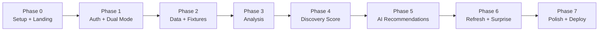

# AI Discovery Coach — Phase-Wise Implementation Plan

This is the build-order playbook for implementing **AI Discovery Coach**. It turns [`problemStatement.md`](./problemStatement.md) and [`architecture.md`](./architecture.md) into concrete, checkable tasks per phase.

Each phase includes: **goal, prerequisites, step-by-step tasks, files to create, env/config, testing, and a Definition of Done (DoD)**. Work top to bottom — each phase is independently shippable.

---

## How to Use This Plan

- Complete phases in order; do not start a phase until the previous DoD is met.
- Each task is written as an actionable item you can turn into a commit.
- `☐` = to do. Check items off as you go.
- **Demo mode is built alongside Spotify mode** (Phases 1–2), not bolted on later.
- Recommended git flow: one branch per phase (`phase-0-setup`, `phase-1-auth`, …), PR into `main`.

### Legend

| Symbol | Meaning |
|--------|---------|
| ☐ | Task to complete |
| 📁 | File or folder to create |
| 🔑 | Environment variable |
| ✅ | Definition of Done item |

---

## Environment Variables (Master List)

Set these in `.env.local` (dev) and Vercel project settings (prod). Never commit secrets.

| Variable | Phase | Purpose |
|----------|-------|---------|
| 🔑 `SPOTIFY_CLIENT_ID` | 1 | Spotify app client ID |
| 🔑 `SPOTIFY_CLIENT_SECRET` | 1 | Spotify app client secret |
| 🔑 `SPOTIFY_REDIRECT_URI` | 1 | OAuth callback (e.g. `http://127.0.0.1:3000/api/auth/callback`) |
| 🔑 `SESSION_SECRET` | 1 | Key for encrypting the session cookie |
| 🔑 `GROQ_API_KEY` | 5 | Groq API key |
| 🔑 `GROQ_MODEL` | 5 | Model id (e.g. `llama-3.3-70b-versatile`) |
| 🔑 `DEMO_USE_LIVE_AI` | 5 | `true` = live Groq in demo; `false` = cached responses |
| 🔑 `APP_BASE_URL` | 0 | Base URL for building absolute links |

> Reminder: Spotify does **not** allow `localhost`; use `http://127.0.0.1:PORT` for local redirect URIs.

---

## Phase 0 — Foundation & Project Setup

**Goal:** A deployable Next.js skeleton with tooling, theme, landing page, and dual-entry CTAs.

**Prerequisites:** Node.js LTS, GitHub account, Vercel account.

### Tasks

- ☐ Initialize project: `npx create-next-app@latest` (App Router, TypeScript, Tailwind, ESLint).
- ☐ Enable TypeScript `strict` mode in `tsconfig.json`; configure path aliases (`@/*`).
- ☐ Add Prettier + ESLint config; add `format` and `lint` scripts.
- ☐ 📁 `src/lib/config/env.ts` — parse and validate env vars with Zod; **fail fast** if missing. Mark server-only.
- ☐ Define dark-theme design tokens in `tailwind.config.ts` (Spotify-like palette: near-black bg, green accent) and `src/styles/`.
- ☐ 📁 `src/components/ui/` — build primitives: `Button`, `Card`, `Skeleton`, `Badge`, `Container`.
- ☐ 📁 `src/app/layout.tsx` — root layout, fonts, global dark theme.
- ☐ 📁 `src/app/(marketing)/page.tsx` — landing page with **two CTAs**: `Try Demo` and `Sign in with Spotify` (buttons can be non-functional stubs for now).
- ☐ Add landing copy under Demo: *"Explore with sample data — no account needed."*
- ☐ Initialize git repo; push to GitHub.
- ☐ Connect repo to Vercel; verify preview deployment builds.
- ☐ Set up CI (GitHub Actions or Vercel checks): run `lint` + `typecheck` on PRs.

### Files

```
src/lib/config/env.ts
src/styles/(tokens/globals)
src/components/ui/{Button,Card,Skeleton,Badge,Container}.tsx
src/app/layout.tsx
src/app/(marketing)/page.tsx
tailwind.config.ts
.env.example
```

### Testing

- ☐ `npm run build` succeeds locally.
- ☐ Landing page renders with both CTAs on desktop and mobile widths.
- ☐ Missing env var causes a clear startup error (test by removing one).

### Definition of Done

- ✅ App builds locally and deploys to a Vercel preview URL.
- ✅ Landing page shows dual CTAs with dark theme and responsive layout.
- ✅ Env schema validates and fails fast when variables are missing.
- ✅ Lint + typecheck pass in CI.

---

## Phase 1 — Authentication & Dual-Mode Session

**Goal:** Secure Spotify OAuth **and** demo session, sharing one session model and a `ProfileProvider` abstraction.

**Prerequisites:** Phase 0 done. Spotify app created in the [Developer Dashboard](https://developer.spotify.com/dashboard) with redirect URI registered.

### Tasks — Session & Abstraction

- ☐ 📁 `src/lib/auth/session.ts` — encrypted, HTTP-only cookie session. Define `AppSession` type:
  ```typescript
  type AppSession =
    | { mode: 'demo' }
    | { mode: 'spotify'; accessToken: string; refreshToken: string; expiresAt: number };
  ```
- ☐ Helpers: `getSession()`, `setSession()`, `clearSession()`. Cookie flags: `HttpOnly`, `Secure`, `SameSite=Lax`.
- ☐ 📁 `src/domain/profile/listening-profile.ts` — define `ListeningProfile` interface (topArtists, topTracks, recentlyPlayed, playlists) and domain models (`Artist`, `Track`, `Playlist`).
- ☐ 📁 `src/integration/profile-provider.ts` — `ProfileProvider` interface + factory `getProfileProvider(session)` that returns the correct implementation based on `session.mode`.

### Tasks — Spotify OAuth

- ☐ 📁 `src/lib/auth/spotify-oauth.ts` — Authorization Code flow **with PKCE**: build authorize URL, code/verifier handling.
- ☐ Scopes: `user-top-read`, `user-read-recently-played`, `playlist-read-private`.
- ☐ 📁 `src/app/api/auth/login/route.ts` — start OAuth (redirect to Spotify with PKCE challenge, store verifier + state).
- ☐ 📁 `src/app/api/auth/callback/route.ts` — exchange code for tokens, set `mode: 'spotify'` session, redirect to dashboard.
- ☐ 📁 `src/app/api/auth/logout/route.ts` — clear session.
- ☐ Token refresh: refresh access token when expired (in provider or a `withValidToken` helper).

### Tasks — Demo Session

- ☐ 📁 `src/app/api/demo/route.ts` (or Server Action) — set `mode: 'demo'` server-side, redirect to dashboard.
- ☐ Wire landing page CTAs: `Try Demo` → demo route; `Sign in with Spotify` → `/api/auth/login`.

### Tasks — Route Guard

- ☐ 📁 `src/proxy.ts` — guard `(app)` routes: allow if session is `demo` **or** valid `spotify`; else redirect to landing.
- ☐ 📁 `src/app/(app)/layout.tsx` — authed layout shell (header, demo badge placeholder).

### Files

```
src/lib/auth/{session,spotify-oauth}.ts
src/domain/profile/listening-profile.ts
src/integration/profile-provider.ts
src/app/api/auth/{login,callback,logout}/route.ts
src/app/api/demo/route.ts
src/proxy.ts
src/app/(app)/layout.tsx
```

### Testing

- ☐ Manual: `Sign in with Spotify` completes and lands on dashboard (owner account).
- ☐ Manual: `Try Demo` reaches dashboard with `mode: 'demo'` and no tokens.
- ☐ Protected route redirects to landing when logged out.
- ☐ Token refresh works after access token expiry (simulate by shortening `expiresAt`).
- ☐ Verify no tokens/secrets appear in client bundle or network responses to the browser.

### Definition of Done

- ✅ Both entry paths create a valid session and reach the dashboard.
- ✅ `ProfileProvider` factory selects implementation by mode (implementations stubbed OK).
- ✅ OAuth uses PKCE; tokens stored only in encrypted cookie; refresh works.
- ✅ Proxy blocks unauthenticated access.

---

## Phase 2 — Data Retrieval & Demo Fixtures

**Goal:** Real Spotify data via `SpotifyProfileProvider` and sample data via `FixtureProfileProvider`, both returning identical `ListeningProfile` shapes.

**Prerequisites:** Phase 1 done.

### Tasks — HTTP & Validation Foundation

- ☐ 📁 `src/lib/http/client.ts` — fetch wrapper: timeout, exponential backoff with jitter, **HTTP 429 handling** (respect `Retry-After`).
- ☐ 📁 `src/lib/validation/` — Zod schemas for Spotify responses (artists, tracks, recently played, playlists).

### Tasks — Spotify Provider

- ☐ 📁 `src/integration/spotify/client.ts` — typed client using `lib/http` + user access token.
- ☐ Endpoints: top artists, top tracks, recently played, playlists.
- ☐ 📁 `src/integration/spotify/mappers.ts` — map Spotify DTOs → domain models.
- ☐ 📁 `src/integration/spotify/spotify-profile-provider.ts` — implements `ProfileProvider`; parallelize independent calls.
- ☐ Add short-lived caching/revalidation to reduce API calls.

### Tasks — Fixture Provider (Demo)

- ☐ 📁 `src/fixtures/demo-profile.json` — curated sample profile:
  - 5–10 top artists across 2–3 genres (comfort-zone story)
  - 10–20 top tracks with repeat patterns
  - recently played list
  - 2–3 playlists
- ☐ Use **real Spotify track IDs/URLs** in fixture tracks so `Open in Spotify` works in demo.
- ☐ 📁 `src/integration/fixture/fixture-profile-provider.ts` — implements `ProfileProvider`; returns validated fixture data.

### Files

```
src/lib/http/client.ts
src/lib/validation/spotify.ts
src/integration/spotify/{client,mappers,spotify-profile-provider}.ts
src/integration/fixture/fixture-profile-provider.ts
src/fixtures/demo-profile.json
```

### Testing

- ☐ Unit: mappers convert sample Spotify payloads to domain models.
- ☐ Contract: Zod schemas reject malformed payloads.
- ☐ Fixture validates against the same domain types.
- ☐ Manual: dashboard data loads for both demo and Spotify sessions.
- ☐ Simulate a 429 and confirm backoff/retry behavior.

### Definition of Done

- ✅ Both providers return identical `ListeningProfile` shapes.
- ✅ All four Spotify data sources fetch, validate, and map correctly.
- ✅ Failures degrade gracefully (typed errors, no crashes).
- ✅ Official APIs only; no scraping.

---

## Phase 3 — Listening Behavior Analysis

**Goal:** Convert a `ListeningProfile` into visual insights, identical for both modes.

**Prerequisites:** Phase 2 done.

### Tasks — Domain Logic (pure TS)

- ☐ 📁 `src/domain/analysis/metrics.ts` — pure functions for:
  - Most listened artists
  - Genre diversity (distinct genres / spread)
  - Artist concentration (top-N share)
  - Repeat listening percentage
  - Recently discovered artists
  - Exploration level (composite)
- ☐ 📁 `src/domain/analysis/index.ts` — `analyzeProfile(profile) → AnalysisResult`.

### Tasks — API & UI

- ☐ 📁 `src/app/api/analysis/route.ts` — resolve provider from session, run analysis, return result.
- ☐ 📁 `src/components/insights/` — stat tiles + charts (bar/progress) for each metric.
- ☐ 📁 `src/app/(app)/dashboard/page.tsx` — render insights section with **loading, empty, and error** states.

### Files

```
src/domain/analysis/{metrics,index}.ts
src/app/api/analysis/route.ts
src/components/insights/{StatTile,DiversityChart,ConcentrationChart}.tsx
src/app/(app)/dashboard/page.tsx
```

### Testing

- ☐ Unit: each metric tested against the demo fixture with known expected values.
- ☐ Edge cases: empty history, single artist, single genre.
- ☐ Manual: insights render for demo and Spotify.

### Definition of Done

- ✅ All six analysis metrics implemented and unit-tested with fixtures.
- ✅ Dashboard shows insights with loading/empty/error states.
- ✅ Same analysis code path for both modes.

---

## Phase 4 — Discovery Score

**Goal:** A deterministic 0–100 score with band, explanation, and suggestions.

**Prerequisites:** Phase 3 done (score consumes analysis signals).

### Tasks — Scoring Model

- ☐ 📁 `src/domain/scoring/score.ts` — implement four sub-scores (0–100): genre diversity, artist spread, freshness, new discovery.
- ☐ Weighted average → final score (e.g. 0.30 / 0.25 / 0.25 / 0.20). Clamp 0–100.
- ☐ Map to bands: Comfort Zone (0–30), Moderate Explorer (31–60), Active Explorer (61–80), Discovery Expert (81–100).
- ☐ 📁 `src/domain/scoring/explanation.ts` — rule-based, plain-language explanation + actionable suggestions from the weakest signals.

### Tasks — API & UI

- ☐ 📁 `src/app/api/score/route.ts` — return score, band, explanation, suggestions, breakdown.
- ☐ 📁 `src/components/insights/DiscoveryScore.tsx` — score visual, band label, breakdown bars, suggestions.

### Files

```
src/domain/scoring/{score,explanation}.ts
src/app/api/score/route.ts
src/components/insights/DiscoveryScore.tsx
```

### Testing

- ☐ Unit: identical input → identical score (deterministic).
- ☐ Unit: boundary values land in correct bands (30/31, 60/61, 80/81).
- ☐ Fixture produces a compelling demo band (e.g. Comfort Zone / Moderate Explorer).

### Definition of Done

- ✅ Score is reproducible and deterministic.
- ✅ Band, explanation, and suggestions display correctly.
- ✅ Breakdown bars show the four sub-scores.

---

## Phase 5 — AI Recommendations

**Goal:** Five personalized recommendations with transparent reasoning, artwork, and Spotify links.

**Prerequisites:** Phase 3–4 done. 🔑 `GROQ_API_KEY`, `GROQ_MODEL`.

### Tasks — Groq Integration

- ☐ 📁 `src/integration/groq/client.ts` — Groq client via `lib/http`: timeout, retry, error handling.
- ☐ Configure structured JSON output; 📁 `src/lib/validation/recommendations.ts` — Zod schema for LLM output.
- ☐ Repair/reject malformed output so the UI never breaks.

### Tasks — Recommendation Domain

- ☐ 📁 `src/domain/recommendations/prompt.ts` — build prompt from top artists, genres, recent tracks, and analysis signals.
- ☐ 📁 `src/domain/recommendations/index.ts` — orchestrate: build prompt → call Groq → parse/validate → enrich.
- ☐ 📁 `src/integration/spotify/search.ts` — resolve album artwork + Spotify track URL via Search API (works for both modes).

### Tasks — Demo AI Strategy

- ☐ Respect 🔑 `DEMO_USE_LIVE_AI`: if `false`, serve 📁 `src/fixtures/demo-recommendations.json` (pre-generated). If `true`, call Groq with fixture profile.

### Tasks — API & UI

- ☐ 📁 `src/app/api/recommendations/route.ts` — return exactly 5 validated recommendations.
- ☐ 📁 `src/components/recommendations/RecommendationCard.tsx` — artwork, title, artist, genre, AI explanation, **Open in Spotify**.
- ☐ 📁 `src/components/recommendations/RecommendationGrid.tsx` — grid + skeletons.
- ☐ Render recommendations section on the dashboard.

### Files

```
src/integration/groq/client.ts
src/integration/spotify/search.ts
src/lib/validation/recommendations.ts
src/domain/recommendations/{prompt,index}.ts
src/app/api/recommendations/route.ts
src/components/recommendations/{RecommendationCard,RecommendationGrid}.tsx
src/fixtures/demo-recommendations.json
```

### Testing

- ☐ Unit: prompt builder includes expected context.
- ☐ Contract: schema rejects malformed LLM output; repair path covered.
- ☐ Manual: 5 cards render with all fields; `Open in Spotify` opens correct track.
- ☐ Demo cached mode returns instantly without Groq calls.

### Definition of Done

- ✅ Exactly 5 valid recommendations with all required fields.
- ✅ Working Spotify links and artwork.
- ✅ Malformed LLM output never breaks the UI.
- ✅ Demo works with cached or live AI per env flag.

---

## Phase 6 — Interactive Discovery (Refresh + Surprise Me)

**Goal:** Refresh recommendations, Surprise Me, and Open in Spotify, all with smooth UX.

**Prerequisites:** Phase 5 done.

### Tasks — Refresh Recommendations

- ☐ Track a session-scoped **exclusion list** of previously shown track IDs.
- ☐ Extend `src/app/api/recommendations/route.ts` with a refresh mode that excludes prior songs and reuses the same analysis.
- ☐ 📁 `src/components/recommendations/RefreshButton.tsx` — loading state + smooth card replacement (animation).

### Tasks — Surprise Me

- ☐ 📁 `src/domain/recommendations/surprise.ts` — prompt for one intentionally out-of-comfort-zone pick with: why surprising, why you may still enjoy it, exploration level (Safe Discovery / Moderate Stretch / Bold Discovery).
- ☐ 📁 `src/app/api/surprise/route.ts` — return one validated surprise recommendation.
- ☐ 📁 `src/components/recommendations/SurpriseModal.tsx` — visually distinct featured card/modal with all fields + **Open in Spotify**.

### Tasks — Open in Spotify

- ☐ Ensure every card/modal opens the official Spotify URL in a new tab; **no custom playback**.

### Files

```
src/domain/recommendations/surprise.ts
src/app/api/surprise/route.ts
src/components/recommendations/{RefreshButton,SurpriseModal}.tsx
```

### Testing

- ☐ Refresh does not repeat previously shown songs; analysis unchanged.
- ☐ Surprise Me returns a distinct pick with all required fields and exploration level.
- ☐ Loading states and animations behave on slow networks.
- ☐ All links open in Spotify.

### Definition of Done

- ✅ Refresh avoids duplicates and preserves analysis with a loading state.
- ✅ Surprise Me returns a well-reasoned, distinct pick in a featured card/modal.
- ✅ Every recommendation opens in Spotify; no in-app playback.

---

## Phase 7 — Polish, Hardening & Deployment

**Goal:** Production quality, full state coverage, and a live Vercel deployment.

**Prerequisites:** Phases 0–6 done.

### Tasks — UX Polish

- ✅ Skeleton loading, empty, and error states across **all** sections.
- ✅ Responsive/mobile pass; typography and spacing polish.
- ✅ Smooth animations for cards, modal, and transitions.
- ✅ 📁 Demo badge in dashboard header + banner: *"You're viewing sample data. [Connect Spotify] …"* with working `Connect Spotify` CTA (demo → OAuth).

### Tasks — Hardening

- ✅ Error boundaries + friendly failure messaging for Spotify/Groq/timeout failures.
- ✅ Tune timeouts and retries; rate-limit demo API routes to protect Groq quota.
- ✅ Structured server logging for external calls (latency, status, retries).
- ✅ Security review: cookie flags, minimal scopes, no secret leakage, `mode` set server-side only.

### Tasks — Deployment

- ☐ Configure all env vars in Vercel (production + preview). **Owner/deployment step.**
- ☐ Register production redirect URI in the Spotify dashboard. **Owner/deployment step.**
- ☐ Add up to 4 tester Spotify accounts to the app allowlist. **Owner-only step.**
- ☐ Production deploy; smoke-test both demo and Spotify flows on the live URL. **Owner/deployment step.**

### Testing

- ☐ E2E (optional): landing → demo → dashboard → recommendations → open in Spotify.
- ☐ E2E (optional): landing → Spotify login → dashboard → refresh → surprise.
- ☐ Lighthouse/mobile check for performance and responsiveness.

### Definition of Done

- ✅ All problem-statement requirements met.
- ✅ App is responsive, resilient, and handles errors gracefully.
- ✅ Deployed to production on Vercel; both flows verified live.

---

## Requirement → Phase Coverage

| Requirement (problem statement) | Phase(s) |
|---------------------------------|----------|
| Dual entry (Try Demo / Spotify) | 0, 1 |
| Spotify Authentication (OAuth, no local accounts) | 1 |
| Demo mode indicator | 1, 7 |
| Spotify Data Retrieval (4 sources) | 2 |
| Demo fixtures | 2 |
| Listening Behavior Analysis (6 metrics) | 3 |
| Discovery Score (0–100, bands, explanation, suggestions) | 4 |
| AI Recommendations (5, with reasoning + artwork + link) | 5 |
| Refresh Recommendations | 6 |
| Surprise Me (exploration levels) | 6 |
| Open in Spotify (no playback) | 5, 6 |
| UI Requirements (dark theme, states, responsive) | 0, 7 |
| Non-Functional (security, perf, error handling) | All (hardened in 7) |

---

## Suggested Build Order Summary



---

## Per-Phase Effort (Intermediate Solo Dev)

| Phase | Focus | Est. effort | Difficulty |
|-------|-------|-------------|------------|
| 0 | Setup + landing + CTAs | 2–3 days | Easy |
| 1 | Auth + dual-mode session | 3–5 days | Hard |
| 2 | Data retrieval + fixtures | 2–3 days | Medium |
| 3 | Analysis + insights UI | 3–4 days | Medium |
| 4 | Discovery Score | 2–3 days | Medium |
| 5 | AI recommendations | 4–6 days | Hard |
| 6 | Refresh + Surprise Me | 2–3 days | Medium |
| 7 | Polish + deploy | 3–5 days | Medium |

**Total: ~21–32 working days (~4–6 weeks part-time).**

---

## Cross-Phase Definition of Done (Global)

- ✅ TypeScript strict passes; no lint errors.
- ✅ Secrets only in env; nothing sensitive in the client bundle.
- ✅ Demo and Spotify modes share the same pipeline via `ProfileProvider`.
- ✅ Every external call has timeout, retry, and graceful failure handling.
- ✅ Domain logic (analysis, scoring) is unit-tested with the demo fixture.
- ✅ Deployed and verified on Vercel.
