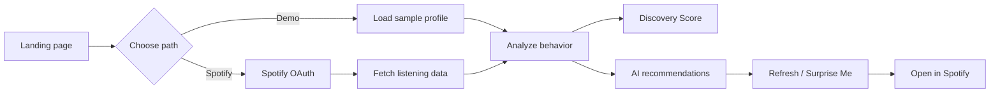

# AI Discovery Coach — Problem Statement

## Overview

Spotify has built one of the world's most sophisticated recommendation systems and serves millions of listeners. Yet a large share of listening still comes from repeat playlists, familiar artists, and tracks users have already discovered.

Many listeners unintentionally stay in their musical comfort zone. That leads to less meaningful discovery, weaker engagement with new artists and genres, and more repetitive listening over time.

**AI Discovery Coach** is a production-ready MVP that tests a simple hypothesis: can an AI-powered discovery experience help users explore more music while keeping recommendations relevant and personalized?

This is **not** a Spotify clone. It is a standalone web app that integrates with Spotify through official APIs to demonstrate a new product feature.

---

## Objective

Build a functional MVP for **AI Discovery Coach** that:

1. Authenticates users with Spotify (no local accounts)
2. Analyzes listening habits from Spotify data
3. Generates AI-powered recommendations with transparent reasoning
4. Encourages meaningful discovery through interactive features

The goal is to help Spotify users discover new music and reduce repetitive listening behavior.

---

## Product Goals

The application should help users:

- Understand their listening habits
- Identify repetitive listening behavior
- Understand why they may be stuck in familiar listening patterns
- Receive new artist and song recommendations powered by AI
- See clear reasoning behind every recommendation
- Explore outside their comfort zone with low friction
- Open and listen to recommended tracks in Spotify

---

## Target Users

Spotify users who:

- Frequently replay the same playlists
- Listen to a limited set of artists
- Want personalized recommendations beyond their usual rotation
- Enjoy discovering new music but do not know where to start
- Have an active Spotify account

---

## Core User Journey

1. User lands on the application
2. User chooses **Try Demo** (no login) or **Sign in with Spotify**
3. **Demo path:** the app loads a curated sample listening profile (no OAuth, no allowlist)
4. **Spotify path:** user signs in via OAuth; the app retrieves data from the Spotify Web API
5. The app analyzes listening behavior and surfaces insights
6. AI generates a **Discovery Score** and personalized recommendations
7. User can refresh recommendations, request a surprise pick, or open tracks in Spotify
8. Demo users can switch to Spotify login at any time from the dashboard
9. User continues exploring new music

---

## Functional Requirements

### 1. Entry & Authentication

**Landing page** — offer two paths:

- **Try Demo** — instant access with sample data; no Spotify account or allowlist required
- **Sign in with Spotify** — full personalized experience via OAuth

**Spotify authentication**

- Implement Spotify OAuth for users who choose the login path
- Authenticate users securely through their Spotify account
- **Do not** create local user accounts
- Show a clear **Demo mode** indicator when sample data is in use

### 2. Spotify Data Retrieval

Using the **Spotify Web API** only (no scraping), retrieve:

- Top artists
- Top tracks
- Recently played tracks
- User playlists

### 3. Listening Behavior Analysis

Analyze listening patterns and present insights visually, including:

- Most listened artists
- Genre diversity
- Artist concentration
- Repeat listening percentage
- Recently discovered artists
- Exploration level

### 4. Discovery Score

Generate a **Discovery Score** from 0–100.

| Score range | Label |
|-------------|-------|
| 0–30 | Comfort Zone Listener |
| 31–60 | Moderate Explorer |
| 61–80 | Active Explorer |
| 81–100 | Discovery Expert |

Display:

- The score
- A plain-language explanation
- Actionable suggestions for improvement

### 5. AI Recommendations

Use an LLM (**Groq** with an open-source model preferred) to generate **5** personalized music recommendations.

Each recommendation must include:

- Song title
- Artist
- Album artwork
- Genre
- AI explanation — why it was recommended
- **Open in Spotify** button

Recommendations should be informed by:

- Listening history
- Favorite artists
- Genres
- Recently played songs

**Example explanation:**

> Recommended because you enjoy indie rock but have never explored dream pop. This artist shares similar instrumentation with your favorite bands.

Use the Spotify Search API when needed to resolve artwork and Spotify URLs.

### 6. Refresh Recommendations

Provide a **Refresh Recommendations** button that:

- Generates a new set of recommendations
- Avoids repeating songs from the previous list
- Keeps the same underlying listening analysis
- Shows a loading state while generating
- Smoothly replaces the recommendation cards

### 7. Surprise Me

Provide a **Surprise Me** feature to encourage exploration outside the user's comfort zone.

When clicked, generate **one** recommendation that is intentionally different from typical listening habits but still likely to appeal.

Display in a visually distinct featured card or modal:

- Album artwork
- Song title
- Artist
- Genre
- Why this pick is surprising
- Why the user may still enjoy it
- Exploration level: **Safe Discovery**, **Moderate Stretch**, or **Bold Discovery**
- **Open in Spotify** button

### 8. Open in Spotify

- Clicking a recommendation opens the corresponding track in Spotify via its official URL
- **Do not** implement custom in-app music playback

---

## UI Requirements

Build a premium, Spotify-inspired interface with:

- Dark theme
- Responsive, mobile-friendly layout
- Smooth animations
- Modern recommendation cards
- Skeleton loading states
- Empty states
- Clear error handling
- Professional typography

---

## Technical Stack

| Layer | Technology |
|-------|------------|
| Frontend | Next.js, TypeScript, Tailwind CSS |
| Authentication | Spotify OAuth |
| AI | Groq API (open-source LLM) |
| Deployment | Vercel |
| Version control | GitHub |

---

## Non-Functional Requirements

- Secure API key management via environment variables
- Responsive on desktop and mobile
- Fast initial page load
- Graceful error handling
- Clean, modular architecture
- Production-quality code
- Straightforward deployment to Vercel

---

## Out of Scope

Do **not** implement:

- A full Spotify clone
- Custom music streaming or playback
- Chat functionality
- Admin panel
- Social features
- Subscription management

Keep the MVP focused on validating AI-powered music discovery.
